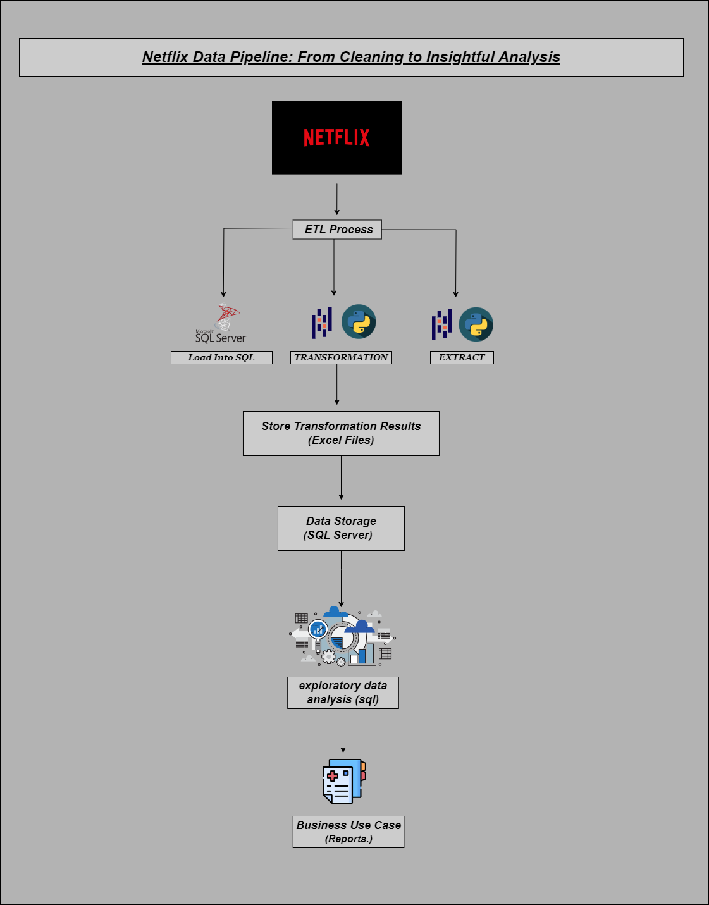

"""
# Netflix Data Cleaning & Analysis Pipeline

## Overview

This project demonstrates a comprehensive data engineering pipeline for cleaning and analyzing Netflix data. The pipeline covers the entire ETL (Extract, Transform, Load) process, in-depth exploratory data analysis (EDA) using Python and SQL, and the generation of business reports based on the analysis.

## Project Workflow

1. **Data Sources**: Extracting data from Netflix CSV files.
2. **ETL Process**:
   - **Extract**: Loading raw data into Python.
   - **Transform**: Cleaning and processing data to extract insights, such as unique directors, country counts, top 5 genres, and TV shows with more than one season.
   - **Load**: Storing the cleaned data into SQL Server.
3. **Store Transformation Results**: Saving transformation results into Excel files for business use.
4. **Data Storage**: Ensuring data is stored securely in SQL Server.
5. **EDA & SQL Analysis**: Conducting exploratory data analysis and additional SQL-based analysis.
6. **Business Reports**: Creating detailed reports to facilitate data-driven decision-making.

## Features

- **Data Extraction**: Pulled raw data from Netflix using CSV files.
- **Data Transformation**: Cleaned and transformed data to extract meaningful insights.
- **Data Loading**: Loaded the clean data into SQL Server for robust storage.
- **Exploratory Data Analysis (EDA)**: Performed in-depth analysis using Python and SQL to uncover valuable trends.
- **Business Use Cases**: Generated reports to assist in strategic business decisions.
